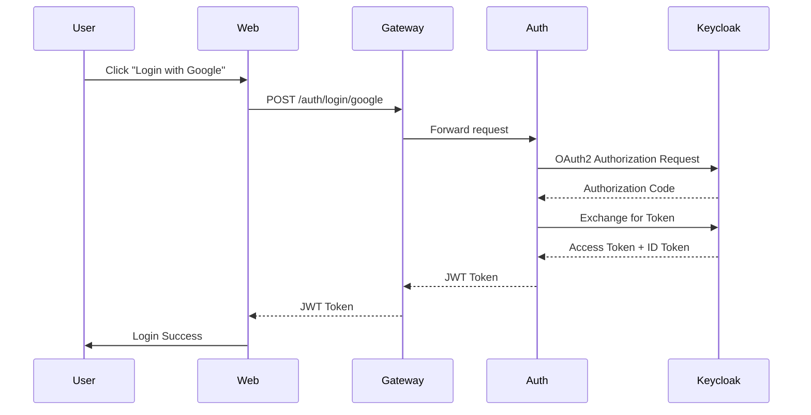
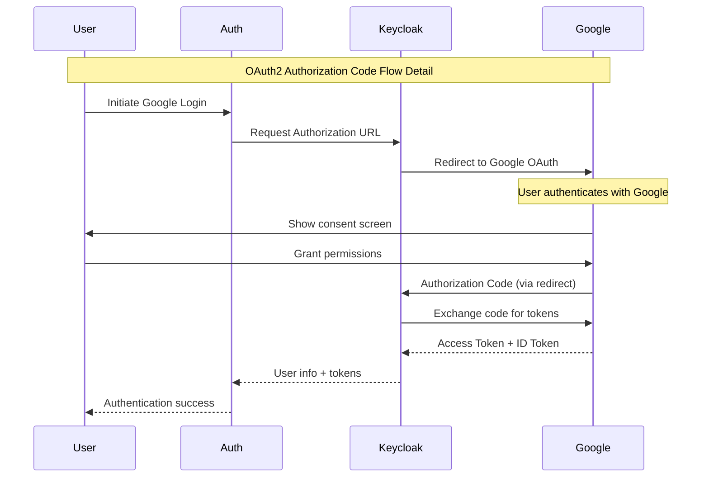
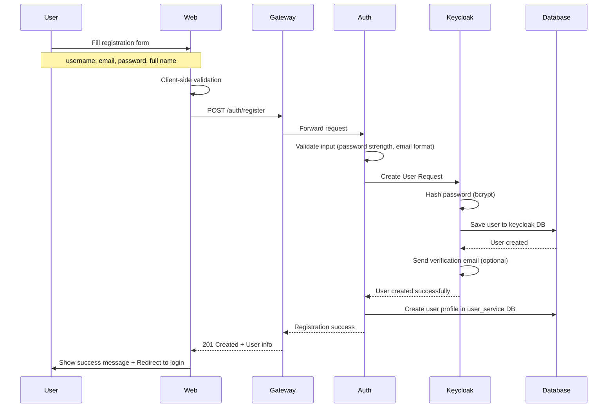
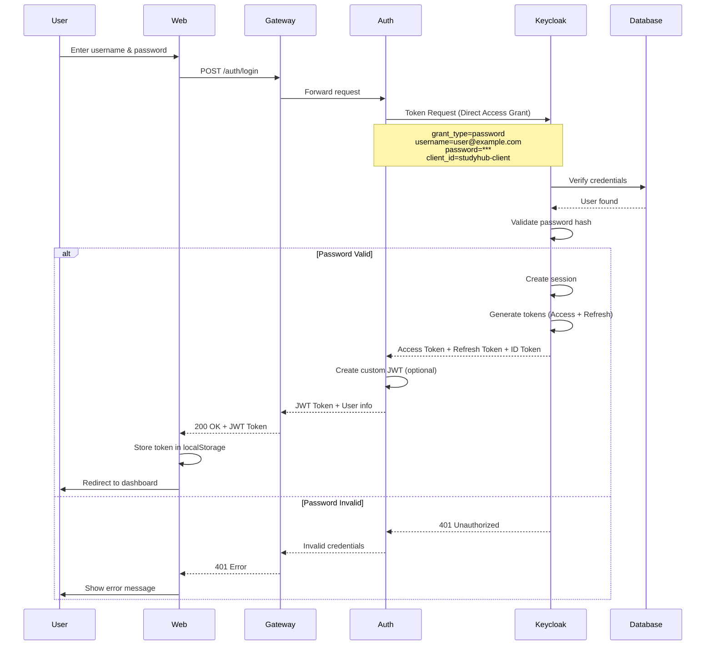
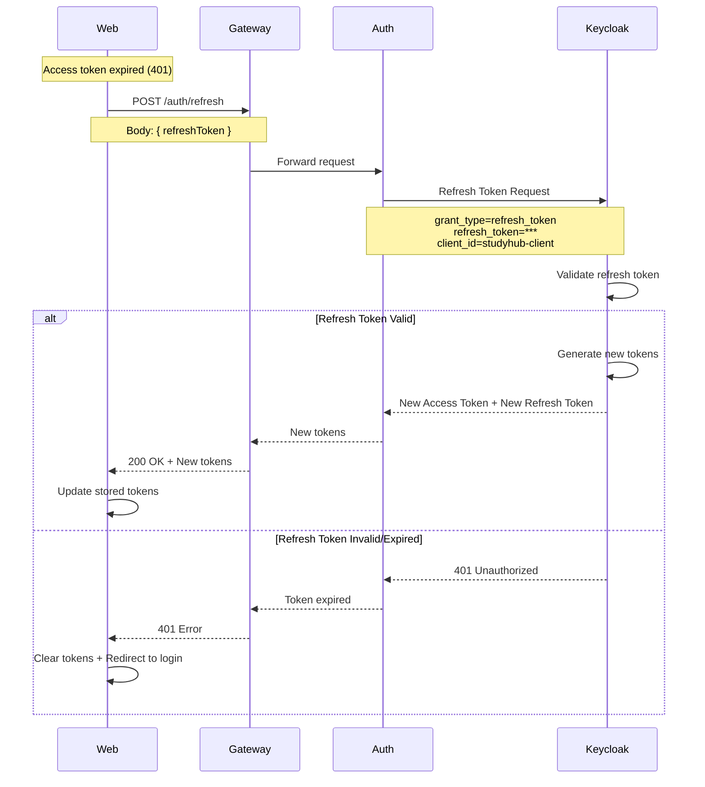
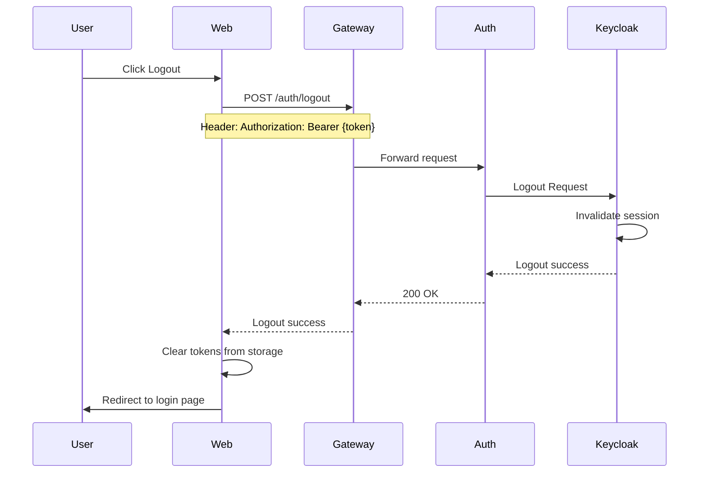

# Luồng Xác Thực Keycloak - StudyHub

## 📋 Tổng Quan

Luồng xác thực Keycloak là một quy trình bảo mật được thiết kế để xác thực người dùng thông qua **OAuth2/OpenID Connect protocol**. Hệ thống StudyHub hỗ trợ hai phương thức xác thực chính:

1. **OAuth2 với Google** - Đăng nhập bằng tài khoản Google (Social Login)
2. **Username/Password** - Đăng ký và đăng nhập bằng tài khoản cục bộ

Cả hai phương thức đều đảm bảo tính bảo mật cao và khả năng mở rộng của ứng dụng.

---

## 🔐 Phương Thức 1: Đăng Nhập Với Google (OAuth2)

### Biểu Đồ Luồng Tổng Quan



### Chi Tiết Luồng OAuth2 với Google


### Giải Thích Chi Tiết Từng Bước

#### 1. User Login với Google
- Người dùng khởi tạo quá trình đăng nhập bằng cách chọn **"Login with Google"** trên giao diện web
- Đây là điểm bắt đầu của luồng xác thực OAuth2

#### 2. Web Gửi Request Đến Gateway
- Ứng dụng web gửi `POST` request đến endpoint `/auth/login/google` thông qua API Gateway
- Request này chứa thông tin về nhà cung cấp danh tính (Google)

#### 3. Gateway Forward Đến Auth Service
- API Gateway nhận request và chuyển tiếp (forward) đến Auth Service
- Gateway có thể thực hiện các kiểm tra bảo mật cơ bản như rate limiting

#### 4. Auth Service Tương Tác Với Keycloak

Auth Service khởi tạo quá trình OAuth2 Authorization với Keycloak. Keycloak được cấu hình để tích hợp với Google Identity Provider.

**Chi tiết luồng OAuth2 với Google:**

##### 4.1. Request Authorization URL
- Auth Service yêu cầu Keycloak tạo authorization URL cho Google
- URL này chứa `client_id`, `redirect_uri`, `scope` và `state` parameters

##### 4.2. Redirect đến Google OAuth
- Keycloak redirect người dùng đến Google OAuth endpoint
- Google hiển thị form đăng nhập và màn hình consent

##### 4.3. User Authentication với Google
- Người dùng nhập credentials trên Google
- Google xác thực thông tin đăng nhập

##### 4.4. Grant Permissions
- Google hiển thị màn hình consent với các quyền được yêu cầu
- Người dùng chấp nhận hoặc từ chối các quyền

##### 4.5. Authorization Code Return
- Google redirect về Keycloak với authorization code
- Code này có thời gian sống ngắn (thường 10 phút)

#### 5. Keycloak Exchange Token Với Google
- Keycloak sử dụng authorization code để đổi lấy access token từ Google
- Request này được thực hiện server-to-server, bảo mật cao
- Google trả về **access token** và **ID token**

#### 6. Keycloak Trả Thông Tin User
- Keycloak nhận tokens từ Google và extract thông tin user
- Tạo session trong Keycloak và trả về Auth Service
- Auth Service nhận được user info và authentication status

#### 7. Trả JWT Token Về Client
- Auth Service tạo và trả về **JWT Token** thông qua Gateway về Web application
- JWT Token chứa thông tin người dùng và quyền truy cập

#### 8. Hoàn Thành Đăng Nhập
- Web application nhận JWT Token và hiển thị thông báo đăng nhập thành công
- Token được lưu trữ (localStorage/sessionStorage) để sử dụng cho các request tiếp theo

---

## 👤 Phương Thức 2: Đăng Ký & Đăng Nhập Với Username/Password

### 2.1. Luồng Đăng Ký (Registration)



### 2.2. Luồng Đăng Nhập (Login with Username/Password)



### 2.3. Chi Tiết Luồng Đăng Ký

#### Bước 1: User Điền Form Đăng Ký
Người dùng điền form với các thông tin:
- **Username**: Tên đăng nhập (unique)
- **Email**: Email (unique, cần verify)
- **Password**: Mật khẩu (tối thiểu 8 ký tự, chứa chữ hoa, chữ thường, số, ký tự đặc biệt)
- **Full Name**: Họ tên đầy đủ
- **Confirm Password**: Xác nhận mật khẩu

#### Bước 2: Client-side Validation
Web application thực hiện validation ngay trên client:
- Kiểm tra định dạng email
- Kiểm tra độ mạnh của mật khẩu
- Kiểm tra password và confirm password khớp nhau
- Kiểm tra các trường required

#### Bước 3: Gửi Request Đến Auth Service
- Request `POST /auth/register` được gửi qua Gateway
- Body chứa: `{ username, email, password, fullName }`

#### Bước 4: Server-side Validation
Auth Service thực hiện validation 
#### Bước 5: Tạo User Trong Keycloak
- Auth Service gọi Keycloak Admin API để tạo user
- Keycloak tự động hash password bằng **bcrypt**
- User được lưu vào Database của Keycloak

#### Bước 6: Gửi Email Xác Thực (Optional)
- Keycloak tự động gửi email verify (nếu được bật)
- User cần click link trong email để activate account

#### Bước 7: Tạo User Profile
- Auth Service tạo user profile trong database của User Service
- Lưu thông tin bổ sung như avatar, bio, preferences

#### Bước 8: Trả Về Kết Quả
- Response `201 Created` với thông tin user (không bao gồm password)
- Client hiển thị thông báo thành công và redirect đến trang login

### 2.4. Chi Tiết Luồng Đăng Nhập

#### Bước 1: User Nhập Credentials
- Username hoặc email
- Password

#### Bước 2: Request Đến Auth Service
```http
POST /auth/login HTTP/1.1
Content-Type: application/json

{
  "username": "john.doe@example.com",
  "password": "SecurePass123!"
}
```

#### Bước 3: Direct Access Grant Flow
Auth Service gọi Keycloak Token Endpoint với grant type `password`:

```http
POST /realms/studyhub/protocol/openid-connect/token HTTP/1.1
Content-Type: application/x-www-form-urlencoded

grant_type=password
&client_id=studyhub-client
&client_secret=***
&username=john.doe@example.com
&password=SecurePass123!
&scope=openid profile email
```

#### Bước 4: Keycloak Xác Thực
- Keycloak query database để tìm user
- So sánh password hash (bcrypt)
- Kiểm tra account status (enabled, not locked, email verified)

#### Bước 5: Tạo Tokens
Nếu xác thực thành công, Keycloak tạo 3 loại token:

**Access Token (JWT)**:
```json
{
  "exp": 1729180800,
  "iat": 1729177200,
  "jti": "a1b2c3d4-e5f6-7890",
  "iss": "https://keycloak.studyhub.com/realms/studyhub",
  "sub": "f47ac10b-58cc-4372-a567-0e02b2c3d479",
  "typ": "Bearer",
  "azp": "studyhub-client",
  "scope": "openid profile email",
  "email_verified": true,
  "name": "John Doe",
  "preferred_username": "john.doe",
  "email": "john.doe@example.com",
  "roles": ["user", "student"]
}
```

**Refresh Token**: Dùng để lấy access token mới khi hết hạn

**ID Token**: Chứa thông tin identity của user

#### Bước 6: Trả JWT Về Client
```json
{
  "accessToken": "eyJhbGciOiJSUzI1NiIs...",
  "refreshToken": "eyJhbGciOiJIUzI1NiIs...",
  "expiresIn": 3600,
  "tokenType": "Bearer",
  "user": {
    "id": "f47ac10b-58cc-4372-a567-0e02b2c3d479",
    "username": "john.doe",
    "email": "john.doe@example.com",
    "fullName": "John Doe",
    "roles": ["user", "student"]
  }
}
```

#### Bước 7: Client Lưu Token
- Access token được lưu trong `localStorage` hoặc `sessionStorage`
- Refresh token được lưu trong `httpOnly cookie` (bảo mật hơn)
- Mọi request sau này sẽ gửi kèm: `Authorization: Bearer {accessToken}`

---

## 🔄 Luồng Refresh Token



---

## 🚪 Luồng Logout



---
## 🧩 Các Thành Phần Chính

### User
- Người dùng cuối sử dụng ứng dụng web
- Thực hiện hành động đăng nhập/đăng ký

### Web Application
- Giao diện người dùng (frontend) - Next.js/React
- Xử lý tương tác với người dùng và hiển thị kết quả
- Lưu trữ JWT token trong localStorage/sessionStorage
- Gửi token trong header `Authorization: Bearer {token}`

### API Gateway (Spring Cloud Gateway)
- Điểm vào duy nhất cho tất cả API requests (Port 8080)
- Thực hiện routing, rate limiting và basic security
- Validate JWT token trước khi forward request
- Load balancing giữa các service instances

### Auth Service (Port 8081)
- Microservice chuyên xử lý xác thực và authorization
- Tương tác với Keycloak để quản lý identity
- Endpoints:
  - `POST /auth/register` - Đăng ký user mới
  - `POST /auth/login` - Đăng nhập với username/password
  - `POST /auth/login/google` - Đăng nhập với Google
  - `POST /auth/refresh` - Refresh access token
  - `POST /auth/logout` - Đăng xuất
  - `GET /auth/me` - Lấy thông tin user hiện tại

### Keycloak
- **Identity and Access Management** (IAM) solution
- Hỗ trợ OAuth2, OpenID Connect
- Integration với external providers (Google, Facebook, GitHub...)
- Đóng vai trò như OAuth2 client khi tích hợp với Google
- Quản lý users, roles, permissions
- Database riêng (Database) để lưu users, sessions

### Google Identity Provider
- External OAuth2/OpenID Connect provider
- Cung cấp authentication và user profile information
- Quản lý consent và permissions cho ứng dụng

### Database
- **Keycloak DB**: Lưu trữ users, sessions, roles của Keycloak
- **Auth DB**: Lưu trữ thông tin xác thực bổ sung
- **User DB**: Lưu trữ user profiles, settings

---
<!-- 
## 🔒 Bảo Mật

### Password Policy
```yaml
Minimum Length: 8 characters
Required Characters:
  - Lowercase letters (a-z)
  - Uppercase letters (A-Z)
  - Numbers (0-9)
  - Special characters (@$!%*?&)
Hashing Algorithm: bcrypt (cost factor: 12)
Password History: Remember last 5 passwords
Max Failed Attempts: 5 (account locked for 15 minutes)
```

### Token Configuration
```yaml
Access Token:
  Expiry: 1 hour (3600 seconds)
  Algorithm: RS256 (RSA Signature with SHA-256)
  Issuer: https://keycloak.studyhub.com/realms/studyhub
  
Refresh Token:
  Expiry: 7 days (604800 seconds)
  Rotation: Enabled (new refresh token on each refresh)
  Reuse Detection: Enabled (revoke all tokens if reuse detected)
  
ID Token:
  Expiry: 1 hour
  Contains: User identity claims (sub, email, name, roles)
```

### Security Headers
```yaml
CORS:
  Allowed Origins: https://studyhub.com, https://app.studyhub.com
  Allowed Methods: GET, POST, PUT, DELETE
  Allowed Headers: Authorization, Content-Type
  Max Age: 3600

Rate Limiting:
  Login Endpoint: 5 requests per minute per IP
  Register Endpoint: 3 requests per hour per IP
  Refresh Endpoint: 10 requests per minute per user
  
HTTPS:
  Enforce: true
  HSTS: max-age=31536000; includeSubDomains
```

---

## 📊 So Sánh Hai Phương Thức Xác Thực

| Tiêu Chí | OAuth2 (Google) | Username/Password |
|----------|----------------|-------------------|
| **Độ phức tạp** | Cao (OAuth2 flow) | Trung bình |
| **Bảo mật** | Rất cao (không lưu password) | Cao (nếu implement đúng) |
| **User Experience** | Tốt (1-click login) | Trung bình (nhập form) |
| **Setup** | Cần Google OAuth2 credentials | Đơn giản hơn |
| **Maintenance** | Phụ thuộc Google | Tự quản lý |
| **Email Verification** | Không cần (Google đã verify) | Cần (gửi email verify) |
| **Password Reset** | Không cần | Cần implement |
| **Offline Access** | Hạn chế | Linh hoạt hơn |
| **Use Case** | Quick signup, social features | Traditional apps, enterprise |

---

## 🎯 Best Practices

### 1. Token Storage
- ✅ **Access Token**: localStorage (dễ access từ JS)
- ✅ **Refresh Token**: httpOnly cookie (bảo mật hơn, không access được từ JS)
- ❌ Không lưu trong sessionStorage (mất khi đóng tab)
- ❌ Không lưu trong cookie thường (dễ bị XSS)

### 2. Token Validation
```java
@Component
public class JwtAuthenticationFilter extends OncePerRequestFilter {
    
    @Override
    protected void doFilterInternal(HttpServletRequest request, 
                                   HttpServletResponse response, 
                                   FilterChain filterChain) {
        String token = extractToken(request);
        
        if (token != null && jwtValidator.validate(token)) {
            // Check token expiry
            if (jwtValidator.isExpired(token)) {
                throw new TokenExpiredException("Token has expired");
            }
            
            // Check if token is blacklisted (logout/revoke)
            if (tokenBlacklist.isBlacklisted(token)) {
                throw new TokenRevokedException("Token has been revoked");
            }
            
            // Set authentication context
            Authentication auth = jwtValidator.getAuthentication(token);
            SecurityContextHolder.getContext().setAuthentication(auth);
        }
        
        filterChain.doFilter(request, response);
    }
}
```

### 3. Error Handling
```java
@ControllerAdvice
public class AuthExceptionHandler {
    
    @ExceptionHandler(InvalidCredentialsException.class)
    public ResponseEntity<ErrorResponse> handleInvalidCredentials(Exception ex) {
        return ResponseEntity.status(HttpStatus.UNAUTHORIZED)
            .body(new ErrorResponse(
                "AUTH_001", 
                "Invalid username or password",
                LocalDateTime.now()
            ));
    }
    
    @ExceptionHandler(TokenExpiredException.class)
    public ResponseEntity<ErrorResponse> handleTokenExpired(Exception ex) {
        return ResponseEntity.status(HttpStatus.UNAUTHORIZED)
            .body(new ErrorResponse(
                "AUTH_002", 
                "Token has expired. Please refresh.",
                LocalDateTime.now()
            ));
    }
    
    @ExceptionHandler(UserAlreadyExistsException.class)
    public ResponseEntity<ErrorResponse> handleUserExists(Exception ex) {
        return ResponseEntity.status(HttpStatus.CONFLICT)
            .body(new ErrorResponse(
                "AUTH_003", 
                "Username or email already exists",
                LocalDateTime.now()
            ));
    }
}
```

### 4. Logging & Monitoring
```java
@Aspect
@Component
public class AuthAuditAspect {
    
    @AfterReturning(pointcut = "execution(* com.studyhub.auth.service.*.login(..))", 
                    returning = "result")
    public void logSuccessfulLogin(JoinPoint joinPoint, Object result) {
        String username = extractUsername(joinPoint.getArgs());
        log.info("Successful login: user={}, timestamp={}, ip={}", 
                 username, LocalDateTime.now(), getClientIP());
        
        // Publish event to Kafka for analytics
        eventPublisher.publish(new UserLoggedInEvent(username, LocalDateTime.now()));
    }
    
    @AfterThrowing(pointcut = "execution(* com.studyhub.auth.service.*.login(..))", 
                   throwing = "ex")
    public void logFailedLogin(JoinPoint joinPoint, Exception ex) {
        String username = extractUsername(joinPoint.getArgs());
        log.warn("Failed login attempt: user={}, timestamp={}, reason={}", 
                 username, LocalDateTime.now(), ex.getMessage());
        
        // Track failed attempts for account locking
        loginAttemptService.recordFailedAttempt(username);
    }
}
```

---

## 🚀 Triển Khai (Implementation Checklist)

### Phase 1: Keycloak Setup
- [ ] Deploy Keycloak instance
- [ ] Tạo realm `studyhub`
- [ ] Tạo client `studyhub-client`
- [ ] Configure Google Identity Provider
- [ ] Setup password policy
- [ ] Configure token settings
- [ ] Create admin user

### Phase 2: Auth Service Development
- [ ] Initialize Spring Boot project
- [ ] Add Keycloak dependencies
- [ ] Implement registration endpoint
- [ ] Implement login endpoint (username/password)
- [ ] Implement login endpoint (Google OAuth2)
- [ ] Implement refresh token endpoint
- [ ] Implement logout endpoint
- [ ] Add JWT validation filter
- [ ] Implement error handling
- [ ] Add audit logging

### Phase 3: Integration
- [ ] Connect Auth Service to Keycloak
- [ ] Setup Database databases
- [ ] Configure API Gateway routing
- [ ] Add rate limiting
- [ ] Setup CORS
- [ ] Add integration tests

### Phase 4: Frontend Integration
- [ ] Create login page
- [ ] Create registration page
- [ ] Implement Google OAuth2 button
- [ ] Add token storage logic
- [ ] Add token refresh logic
- [ ] Add logout functionality
- [ ] Handle authentication errors
- [ ] Add loading states

### Phase 5: Testing & Security
- [ ] Unit tests (80% coverage)
- [ ] Integration tests
- [ ] Security testing (OWASP Top 10)
- [ ] Load testing
- [ ] Penetration testing
- [ ] Fix vulnerabilities

---

## 📚 Tài Liệu Tham Khảo

- [Keycloak Documentation](https://www.keycloak.org/documentation)
- [OAuth 2.0 RFC 6749](https://tools.ietf.org/html/rfc6749)
- [OpenID Connect Core 1.0](https://openid.net/specs/openid-connect-core-1_0.html)
- [JWT RFC 7519](https://tools.ietf.org/html/rfc7519)
- [Spring Security OAuth2](https://spring.io/projects/spring-security-oauth)
- [Google OAuth2 Documentation](https://developers.google.com/identity/protocols/oauth2)

---

## 📝 Notes

### Keycloak Admin Console
```
URL: http://localhost:9090/admin
Username: admin
Password: admin
Realm: studyhub
```

### Useful Keycloak Admin API Calls
```bash
# Get access token
curl -X POST http://localhost:9090/realms/studyhub/protocol/openid-connect/token \
  -d "client_id=admin-cli" \
  -d "username=admin" \
  -d "password=admin" \
  -d "grant_type=password"

# Create user
curl -X POST http://localhost:9090/admin/realms/studyhub/users \
  -H "Authorization: Bearer {admin_token}" \
  -H "Content-Type: application/json" \
  -d '{
    "username": "testuser",
    "email": "test@example.com",
    "enabled": true,
    "credentials": [{
      "type": "password",
      "value": "Password123!",
      "temporary": false
    }]
  }'
```

---

**Tài liệu được tạo cho dự án StudyHub**  
**Version**: 1.0  
**Last Updated**: October 17, 2025 -->